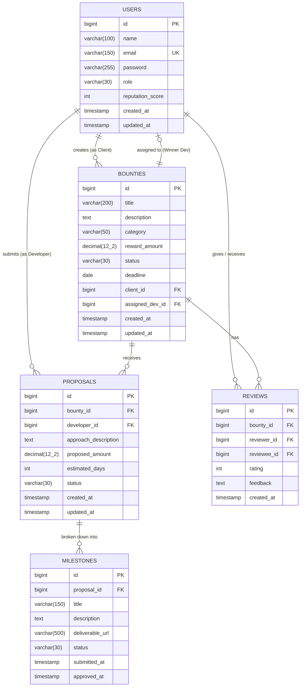

# OpenBounty — Database Schema & Data Architecture Guide

This document defines the physical relational schema, data dictionary, indexing strategies, and database optimization techniques for the **OpenBounty** platform running on **PostgreSQL 15+**.

---

## 1. Entity Relationship Diagram (ERD)



---

## 2. PostgreSQL Data Definition Language (DDL)

```sql
-- =============================================================================
-- 1. USERS TABLE
-- =============================================================================
CREATE TABLE users (
    id BIGSERIAL PRIMARY KEY,
    name VARCHAR(100) NOT NULL,
    email VARCHAR(150) NOT NULL UNIQUE,
    password VARCHAR(255) NOT NULL,
    role VARCHAR(30) NOT NULL,
    reputation_score INT NOT NULL DEFAULT 0,
    created_at TIMESTAMP WITHOUT TIME ZONE NOT NULL DEFAULT CURRENT_TIMESTAMP,
    updated_at TIMESTAMP WITHOUT TIME ZONE DEFAULT CURRENT_TIMESTAMP,
    CONSTRAINT chk_user_role CHECK (role IN ('ROLE_CLIENT', 'ROLE_DEVELOPER', 'ROLE_ADMIN'))
);

-- =============================================================================
-- 2. BOUNTIES TABLE
-- =============================================================================
CREATE TABLE bounties (
    id BIGSERIAL PRIMARY KEY,
    title VARCHAR(200) NOT NULL,
    description TEXT NOT NULL,
    category VARCHAR(50) NOT NULL,
    reward_amount NUMERIC(12, 2) NOT NULL CHECK (reward_amount > 0),
    status VARCHAR(30) NOT NULL DEFAULT 'OPEN',
    deadline DATE NOT NULL,
    client_id BIGINT NOT NULL,
    assigned_dev_id BIGINT,
    created_at TIMESTAMP WITHOUT TIME ZONE NOT NULL DEFAULT CURRENT_TIMESTAMP,
    updated_at TIMESTAMP WITHOUT TIME ZONE DEFAULT CURRENT_TIMESTAMP,
    CONSTRAINT fk_bounties_client FOREIGN KEY (client_id) REFERENCES users(id) ON DELETE RESTRICT,
    CONSTRAINT fk_bounties_assigned_dev FOREIGN KEY (assigned_dev_id) REFERENCES users(id) ON DELETE SET NULL,
    CONSTRAINT chk_bounty_status CHECK (status IN ('OPEN', 'IN_REVIEW', 'ASSIGNED', 'IN_PROGRESS', 'COMPLETED', 'CANCELLED')),
    CONSTRAINT chk_bounty_category CHECK (category IN (
        'WEB_DEVELOPMENT', 'MOBILE_APP', 'BACKEND_API', 'DEVOPS_CLOUD',
        'AI_ML', 'SECURITY_AUDIT', 'UI_UX_DESIGN', 'OTHER'
    ))
);

-- =============================================================================
-- 3. PROPOSALS TABLE
-- =============================================================================
CREATE TABLE proposals (
    id BIGSERIAL PRIMARY KEY,
    bounty_id BIGINT NOT NULL,
    developer_id BIGINT NOT NULL,
    approach_description TEXT NOT NULL,
    proposed_amount NUMERIC(12, 2) NOT NULL CHECK (proposed_amount > 0),
    estimated_days INT NOT NULL CHECK (estimated_days > 0),
    status VARCHAR(30) NOT NULL DEFAULT 'PENDING',
    created_at TIMESTAMP WITHOUT TIME ZONE NOT NULL DEFAULT CURRENT_TIMESTAMP,
    updated_at TIMESTAMP WITHOUT TIME ZONE DEFAULT CURRENT_TIMESTAMP,
    CONSTRAINT fk_proposals_bounty FOREIGN KEY (bounty_id) REFERENCES bounties(id) ON DELETE CASCADE,
    CONSTRAINT fk_proposals_developer FOREIGN KEY (developer_id) REFERENCES users(id) ON DELETE RESTRICT,
    CONSTRAINT uq_bounty_developer UNIQUE (bounty_id, developer_id),
    CONSTRAINT chk_proposal_status CHECK (status IN ('PENDING', 'ACCEPTED', 'REJECTED'))
);

-- =============================================================================
-- 4. MILESTONES TABLE
-- =============================================================================
CREATE TABLE milestones (
    id BIGSERIAL PRIMARY KEY,
    proposal_id BIGINT NOT NULL,
    title VARCHAR(150) NOT NULL,
    description TEXT,
    deliverable_url VARCHAR(500),
    status VARCHAR(30) NOT NULL DEFAULT 'PENDING',
    submitted_at TIMESTAMP WITHOUT TIME ZONE,
    approved_at TIMESTAMP WITHOUT TIME ZONE,
    CONSTRAINT fk_milestones_proposal FOREIGN KEY (proposal_id) REFERENCES proposals(id) ON DELETE CASCADE,
    CONSTRAINT chk_milestone_status CHECK (status IN ('PENDING', 'SUBMITTED', 'APPROVED'))
);

-- =============================================================================
-- 5. REVIEWS TABLE
-- =============================================================================
CREATE TABLE reviews (
    id BIGSERIAL PRIMARY KEY,
    bounty_id BIGINT NOT NULL,
    reviewer_id BIGINT NOT NULL,
    reviewee_id BIGINT NOT NULL,
    rating INT NOT NULL CHECK (rating >= 1 AND rating <= 5),
    feedback TEXT,
    created_at TIMESTAMP WITHOUT TIME ZONE NOT NULL DEFAULT CURRENT_TIMESTAMP,
    CONSTRAINT fk_reviews_bounty FOREIGN KEY (bounty_id) REFERENCES bounties(id) ON DELETE CASCADE,
    CONSTRAINT fk_reviews_reviewer FOREIGN KEY (reviewer_id) REFERENCES users(id) ON DELETE RESTRICT,
    CONSTRAINT fk_reviews_reviewee FOREIGN KEY (reviewee_id) REFERENCES users(id) ON DELETE RESTRICT,
    CONSTRAINT uq_review_participant UNIQUE (bounty_id, reviewer_id, reviewee_id)
);
```

---

## 3. Indexing Strategy & Performance Optimization

To guarantee sub-millisecond lookups and scalable search operations at high data volume:

```sql
-- Indexes for Users
CREATE INDEX idx_users_email ON users(email);
CREATE INDEX idx_users_role ON users(role);

-- Indexes for Bounties (Filtering, Pagination, and Foreign Keys)
CREATE INDEX idx_bounties_status ON bounties(status);
CREATE INDEX idx_bounties_category ON bounties(category);
CREATE INDEX idx_bounties_client_id ON bounties(client_id);
CREATE INDEX idx_bounties_assigned_dev_id ON bounties(assigned_dev_id);
CREATE INDEX idx_bounties_created_at ON bounties(created_at DESC);

-- Composite Index for Common Bounty Marketplace Filtering
CREATE INDEX idx_bounties_status_category ON bounties(status, category);

-- Indexes for Proposals
CREATE INDEX idx_proposals_bounty_id ON proposals(bounty_id);
CREATE INDEX idx_proposals_developer_id ON proposals(developer_id);
CREATE INDEX idx_proposals_status ON proposals(status);

-- Indexes for Milestones
CREATE INDEX idx_milestones_proposal_id ON milestones(proposal_id);
CREATE INDEX idx_milestones_status ON milestones(status);

-- Indexes for Reviews & Reputation Aggregation
CREATE INDEX idx_reviews_reviewee_id ON reviews(reviewee_id);
CREATE INDEX idx_reviews_bounty_id ON reviews(bounty_id);
```

---

## 4. Data Dictionary

| Table | Column | Type | Constraints | Description |
| :--- | :--- | :--- | :--- | :--- |
| **`users`** | `id` | `BIGSERIAL` | `PK`, Auto-increment | Unique identifier for the user |
| | `name` | `VARCHAR(100)` | `NOT NULL` | Full display name |
| | `email` | `VARCHAR(150)` | `NOT NULL`, `UNIQUE` | Unique login email address |
| | `password` | `VARCHAR(255)` | `NOT NULL` | BCrypt salted hash |
| | `role` | `VARCHAR(30)` | `NOT NULL` | User role (`ROLE_CLIENT`, `ROLE_DEVELOPER`, `ROLE_ADMIN`) |
| | `reputation_score` | `INT` | `NOT NULL`, `DEFAULT 0` | Cumulative score earned upon completing bounties |
| | `created_at` | `TIMESTAMP` | `NOT NULL` | Account registration timestamp |
| | `updated_at` | `TIMESTAMP` | | Last profile update timestamp |
| **`bounties`** | `id` | `BIGSERIAL` | `PK`, Auto-increment | Unique identifier for the challenge |
| | `title` | `VARCHAR(200)` | `NOT NULL` | Short summary title |
| | `description` | `TEXT` | `NOT NULL` | Full challenge problem description & requirements |
| | `category` | `VARCHAR(50)` | `NOT NULL` | Domain category classification |
| | `reward_amount` | `NUMERIC(12,2)`| `NOT NULL`, `> 0` | Funded bounty reward amount |
| | `status` | `VARCHAR(30)` | `NOT NULL`, `DEFAULT 'OPEN'` | Lifecycle state machine status |
| | `deadline` | `DATE` | `NOT NULL` | Expected completion deadline |
| | `client_id` | `BIGINT` | `FK -> users(id)`, `NOT NULL` | Client who posted and funded the challenge |
| | `assigned_dev_id` | `BIGINT` | `FK -> users(id)` | Winning developer assigned to solve challenge |
| | `created_at` | `TIMESTAMP` | `NOT NULL` | Creation timestamp |
| | `updated_at` | `TIMESTAMP` | | Last update timestamp |
| **`proposals`** | `id` | `BIGSERIAL` | `PK`, Auto-increment | Unique proposal identifier |
| | `bounty_id` | `BIGINT` | `FK -> bounties(id)`, `NOT NULL` | Target bounty |
| | `developer_id`| `BIGINT` | `FK -> users(id)`, `NOT NULL` | Developer submitting the proposal |
| | `approach_description`| `TEXT` | `NOT NULL` | Detailed technical architecture/solution approach |
| | `proposed_amount`| `NUMERIC(12,2)`| `NOT NULL`, `> 0` | Proposed bid cost |
| | `estimated_days` | `INT` | `NOT NULL`, `> 0` | Estimated delivery time in days |
| | `status` | `VARCHAR(30)` | `NOT NULL`, `DEFAULT 'PENDING'`| Proposal state (`PENDING`, `ACCEPTED`, `REJECTED`) |
| **`milestones`** | `id` | `BIGSERIAL` | `PK`, Auto-increment | Unique milestone identifier |
| | `proposal_id` | `BIGINT` | `FK -> proposals(id)`, `NOT NULL`| Parent proposal |
| | `title` | `VARCHAR(150)` | `NOT NULL` | Deliverable title |
| | `description` | `TEXT` | | Deliverable scope details |
| | `deliverable_url` | `VARCHAR(500)`| | Proof URL (GitHub PR, staging link, doc) |
| | `status` | `VARCHAR(30)` | `NOT NULL`, `DEFAULT 'PENDING'`| Milestone state (`PENDING`, `SUBMITTED`, `APPROVED`) |
| | `submitted_at`| `TIMESTAMP` | | Developer submission timestamp |
| | `approved_at` | `TIMESTAMP` | | Client approval timestamp |
| **`reviews`** | `id` | `BIGSERIAL` | `PK`, Auto-increment | Unique review identifier |
| | `bounty_id` | `BIGINT` | `FK -> bounties(id)`, `NOT NULL` | Associated completed bounty |
| | `reviewer_id` | `BIGINT` | `FK -> users(id)`, `NOT NULL` | User giving the review |
| | `reviewee_id` | `BIGINT` | `FK -> users(id)`, `NOT NULL` | User receiving the review |
| | `rating` | `INT` | `NOT NULL`, `1 <= rating <= 5` | Star rating |
| | `feedback` | `TEXT` | | Written review comment |
