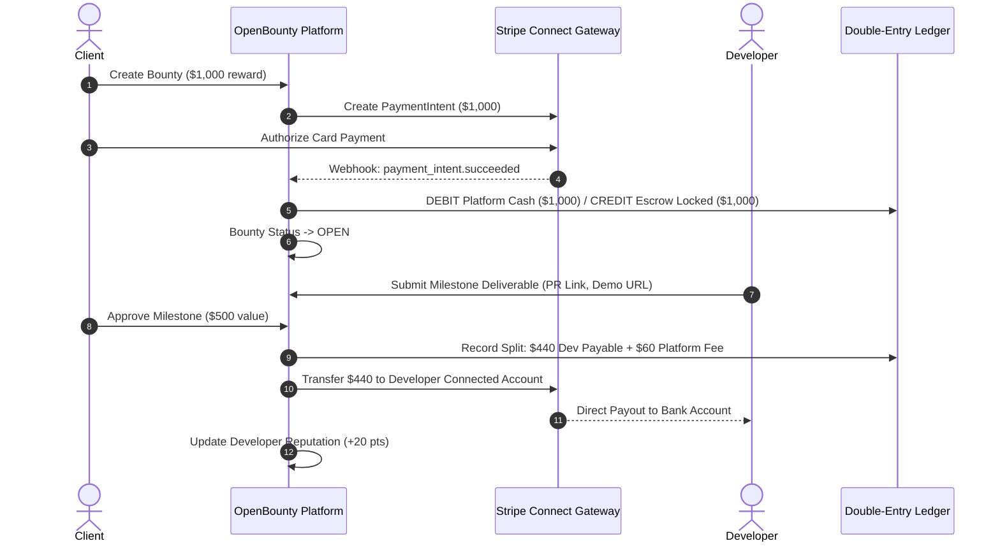
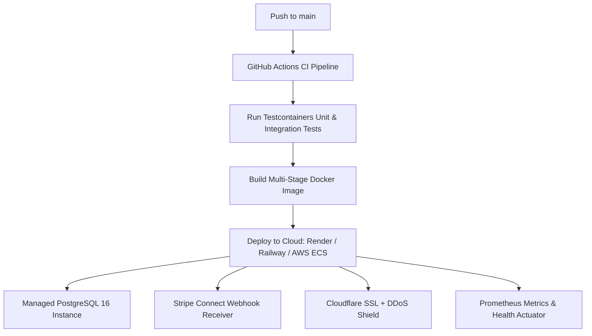

# 🚀 OpenBounty — Dual-Track Zero-to-Launch Playbook: Engineering Mastery & Commercial Go-To-Market

This master playbook defines the end-to-end execution path for **OpenBounty**, structured across a **Dual-Track Strategy**:
1. **Track 1: Resume & Technical Excellence** — Building an elite-tier engineering showcase demonstrating financial correctness (Double-Entry Ledger), concurrency control (Pessimistic Locking), idempotency, and Testcontainers integration testing for FAANG/tier-1 technical interviews.
2. **Track 2: Commercial Marketplace Viability** — Delivering a viable, escrow-backed challenge marketplace monetized via a 10–15% platform take-rate, Stripe Connect payouts, and GitHub integration.

---

```text
┌────────────────────────────────────────────────────────────────────────────────────────────────────────┐
│                                   DUAL-TRACK EXECUTION LIFECYCLE                                       │
│                                                                                                        │
│  [Stage 1] Core Engineering ──► [Stage 2] Financial Ledger & Stripe ──► [Stage 3] Testcontainers & QA │
│                                                                                     │                  │
│  [Stage 6] Commercial GTM   ◄── [Stage 5] Interview & Resume Ready  ◄── [Stage 4] Cloud Deployment    │
└────────────────────────────────────────────────────────────────────────────────────────────────────────┘
```

---

## 🎯 1. Executive Strategy: The Dual-Track Value Formula

```text
[ Career / Project Leverage ] = [ Technical Depth & Concurrency ] × [ Production Commercial Reality ]
```

A standard tutorial CRUD app signals junior ability. Conversely, building a project with:
* **Real financial transactions** (Stripe Connect escrow + Double-entry ledger).
* **Guaranteed concurrency safety** (Pessimistic locking preventing race conditions on bounties and milestones).
* **Idempotent mutations** (Handling retries safely with zero duplicate payouts).
* **Production testing rigor** (Testcontainers with real PostgreSQL and Redis instances).

instantly elevates your project into senior engineering territory while providing a real foundation to launch a profitable business.

---

## 🎙️ 2. The Technical Interview & Resume Playbook (Track 1)

How to feature OpenBounty on your resume and dominate systems design and backend technical interviews.

### 2.1 High-Impact Resume Bullet Points
Use these metrics-driven bullet points for your resume / portfolio:

> * **OpenBounty | Enterprise Challenge & Escrow Marketplace** *(Java 21, Spring Boot 3.3, PostgreSQL 16, Stripe Connect, Docker, Testcontainers)*
>   * Architected an escrow-backed collaboration marketplace with Spring Boot 3.3 and PostgreSQL, enforcing ACID financial consistency using a double-entry ledger and pessimistic locking (`SELECT ... FOR UPDATE`) to prevent race conditions during proposal bidding and milestone payouts.
>   * Designed an idempotency engine caching request tokens to guarantee zero duplicate charges and payouts across flaky network retries during Stripe webhook processing.
>   * Implemented stateless JWT security with cryptographically signed tokens, BCrypt work factor 12, and granular Role-Based Access Control (RBAC) across Client, Developer, and Admin personas.
>   * Developed automated integration test suites using **Testcontainers** to spin up ephemeral PostgreSQL and Redis Docker containers, eliminating H2 dialect discrepancies and achieving 85%+ business logic coverage.
>   * Built an automated 14-day inactivity auto-release worker using Spring Task Scheduling to protect developer compensation against client ghosting.

---

### 2.2 System Design & Interview Defense Scenarios

When interviewers ask about OpenBounty, here are the architectural defenses to present:

#### Question 1: "How do you handle race conditions if two clients or developers submit actions simultaneously?"
* **Answer**: "For state transitions like accepting a proposal or approving a milestone payout, we don't rely on simple JPA `@Transactional`. We use **Pessimistic Locking** (`LockModeType.PESSIMISTIC_WRITE`) at the database level (`SELECT ... FOR UPDATE`). When a transaction acquires the row lock, concurrent requests queue until the lock is released or timeout. For proposal acceptance, we atomically assign the winning developer, transition the bounty to `ASSIGNED`, and trigger a bulk JPQL query that sets all competing proposals to `REJECTED` in a single ACID transaction."

#### Question 2: "How do you guarantee financial integrity and avoid double-spending or money creation?"
* **Answer**: "We implemented an immutable **Double-Entry Ledger** (`ledger_entries`). We never simply increment or decrement a balance integer column. Every financial movement consists of two balanced lines: a DEBIT and a CREDIT across accounts (`PLATFORM_CASH`, `CLIENT_ESCROW_LOCKED`, `DEVELOPER_PAYABLE`, `PLATFORM_FEE_REVENUE`). A database constraint and service-level invariant verify that `SUM(debit) == SUM(credit)`. If an invariant is violated, the transaction rolls back immediately."

#### Question 3: "What happens if a network timeout occurs during milestone payout?"
* **Answer**: "We implement an **Idempotency-Key** header. The client sends a unique UUID with every mutating payment request. The backend hashes the request body and stores the idempotency key in an atomic cache/table. If the client retries the request due to a network glitch, our interceptor recognizes the duplicate key and returns the cached result without re-executing the payment or ledger transfer."

#### Question 4: "Why use Testcontainers instead of H2 in-memory database for tests?"
* **Answer**: "In-memory H2 databases fail to replicate PostgreSQL-specific features: JSONB columns, pessimistic row locking semantics, native check constraints, and timezone handling. By using **Testcontainers**, our CI/CD pipeline boots real, lightweight PostgreSQL 16 Docker containers, ensuring zero discrepancy between local tests and production behavior."

---

## 💰 3. Commercial Marketplace & Monetization Architecture (Track 2)

### 3.1 Monetization Model: The 10–15% Platform Take-Rate
OpenBounty operates as an escrow marketplace with an automated commission structure:
1. **Client Funds Challenge**: Client deposits $1,000 via Stripe Checkout into platform escrow.
2. **Developer Delivers Milestones**: Work is split into milestones (e.g. Milestone 1: $500, Milestone 2: $500).
3. **Approval & Split**:
   * Upon client approval, the system takes a **12% platform take-rate fee** ($60).
   * **88%** ($440) is immediately transferred via Stripe Connect to the developer's connected bank account.
   * Net platform revenue: $60 per milestone, $120 total on the bounty.



### 3.2 Solving the Two-Sided Marketplace "Cold Start"
Marketplaces face a classic dilemma: developers want bounties, and clients want developers.

```text
               ┌────────────────────────────────────────────────────────┐
               │              OVERCOMING THE COLD START                 │
               └────────────────────────────────────────────────────────┘
                                            │
          ┌─────────────────────────────────┴─────────────────────────────────┐
          ▼                                                                   ▼
[ Supply Side: Developers ]                                         [ Demand Side: Bounties ]
1. Seed with 10–15 funded bounties ($100–$500).                     1. Partner with 5 early-stage open source maintainers.
2. 1-Click GitHub OAuth onboarding.                                 2. Offer 0% platform fee for the first 50 bounties.
3. Shareable developer portfolio profile with verified badges.       3. Build GitHub Issue Bot ("/bounty $150").
```

#### Growth Playbook:
1. **GitHub Issue Integration (The Friction Killer)**:
   * Maintainers don't want to log into another portal to post bounties.
   * A GitHub bot that allows typing `/bounty $150` on any GitHub issue automatically creates and links the bounty on OpenBounty.
2. **Community Seeding**:
   * Post in r/SideProject, r/reactjs, r/java, Hacker News Show HN, and developer Discord communities with real funded bounties.
   * Solvers join immediately because real cash rewards are on the line.
3. **Public Developer Portfolio**:
   * Every developer receives a public URL (`openbounty.dev/u/{username}`) showcasing verified completed milestones, earned revenue, and peer ratings. This encourages developers to share their profile on LinkedIn and Twitter.

---

## 🛠️ 4. Engineering Implementation Roadmap Summary

Refer to [`ROADMAP.md`](ROADMAP.md) for full phase details:

| Phase | Milestone | Primary Track Signal | Status |
| :--- | :--- | :--- | :--- |
| **1–5** | Project Setup, JPA Schema, Repositories, DTOs, Stateless JWT Auth | Foundation | **Completed ✅** |
| **6** | Bounty Module (CRUD, Category Filtering, Dynamic Specification) | Foundation | **Completed ✅** |
| **7** | Proposals & Bids (Atomic Acceptance, Pessimistic Locking) | Engineering Signal | **Completed ✅** |
| **8** | Milestone & Deliverable Verification Workflow | Core Product | **Completed ✅** |
| **9** | Reviews, Ratings & Algorithmic Reputation Engine | Commercial Trust | **In Queue 🚀** |
| **10** | Stripe Escrow Rails & Take-Rate Commission Engine | Commercial Signal | **Planned 💰** |
| **11** | Dispute Protocol & 14-Day Inactivity Auto-Release Worker | Marketplace Trust | **Planned ⚖️** |
| **12** | Double-Entry Financial Ledger & Idempotency Key Filter | Engineering Signal | **Planned 📒** |
| **13** | Testcontainers Integration Testing & Cloud Infrastructure | Engineering Signal | **Planned 🛡️** |
| **14** | Production Launch, Portfolio Polish & GTM Campaign | Dual Launch | **Planned 🚀** |

---

## 🛡️ 5. Production Cloud Deployment & Monitoring

### 5.1 Architecture Topology


### 5.2 Production Configuration
```properties
SERVER_PORT=8080
SPRING_PROFILES_ACTIVE=prod
DB_URL=jdbc:postgresql://<db-host>:5432/<db-name>?sslmode=require
DB_USERNAME=<db-user>
DB_PASSWORD=<db-password>
JWT_SECRET=<random-64-character-hex-secret>
STRIPE_API_KEY=sk_live_...
STRIPE_WEBHOOK_SECRET=whsec_...
PLATFORM_FEE_PERCENTAGE=12.0
```

---

## 📋 6. Summary Dual-Track Pre-Flight Checklist

### Track 1: Technical & Resume Readiness Checklist
- [x] Spring Boot 3.3.3 + Java 21 LTS modular architecture with clean package separation.
- [x] Stateless JWT authentication with BCrypt work factor 12.
- [x] RFC 7807 standardized problem details error responses.
- [ ] Concurrency-safe proposal acceptance using pessimistic locking (`SELECT ... FOR UPDATE`).
- [ ] Immutable Double-Entry Ledger (`ledger_entries`) recording balanced debits and credits.
- [ ] Idempotency key interceptor caching and verifying request tokens.
- [ ] Automated integration test suite running with **Testcontainers** (PostgreSQL 16 & Redis).
- [ ] Actuator health, liveness, and Prometheus metrics exposed for observability.

### Track 2: Commercial Marketplace Readiness Checklist
- [ ] Stripe Connect escrow deposit and automated payout split (10–15% take-rate).
- [ ] Stripe webhook listener with cryptographic signature verification.
- [ ] Inactivity auto-release guard: 14-day timer releasing funds if client ghosts.
- [ ] Dispute arbitration endpoint and status workflow.
- [ ] Next.js / React frontend with GitHub OAuth login.
- [ ] Seeded with 10–15 real funded bounties before public launch.
- [ ] Public developer profile pages (`/u/{username}`) with verifiable milestone history.
