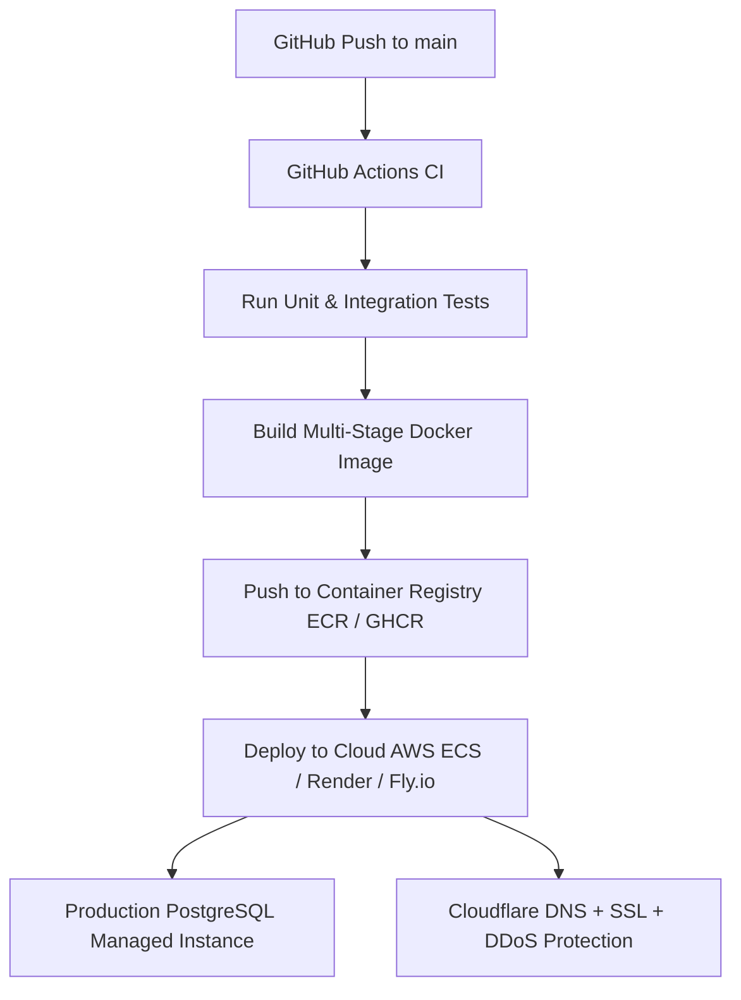

# 🚀 OpenBounty — Zero-to-Launch Playbook: From Development to Production & User Acquisition

This document is the definitive master guide outlining how to build, harden, deploy, and scale **OpenBounty** from initial line of code to a live, production-ready platform with active clients and developers.

---

```text
┌─────────────────────────────────────────────────────────────────────────────────────────────────────────┐
│                                    ZERO-TO-LAUNCH LIFECYCLE                                             │
│                                                                                                         │
│  [Stage 1] Core Engineering  ──►  [Stage 2] Frontend & UX  ──►  [Stage 3] Hardening & Testing           │
│                                                                                  │                      │
│  [Stage 6] Growth & Scaling  ◄──  [Stage 5] Go-To-Market   ◄──  [Stage 4] Cloud Deployment              │
└─────────────────────────────────────────────────────────────────────────────────────────────────────────┘
```

---

## 🎯 Executive Overview & Target Personas

OpenBounty succeeds by creating a high-trust, two-sided marketplace:
1. **Clients / Organizations / Open-Source Maintainers**:
   - **Problem**: Have technical challenges, feature requests, or bugs but lack immediate engineering bandwidth.
   - **Value Proposition**: Escrow-backed milestone delivery, verified code solutions, no upfront risk without reviewed deliverables.
2. **Developers / Freelancers / Solvers**:
   - **Problem**: Need real-world projects, verified proof-of-work, and financial compensation.
   - **Value Proposition**: Transparent bidding, guaranteed rewards upon milestone verification, public on-chain/platform reputation score.

---

## Stage 1: Core Backend Engineering & Local Setup

### 1.1 Development Environment Bootstrapping
1. **Install Prerequisites**:
   - JDK 21 LTS (`java -version`)
   - Apache Maven 3.9+ (`mvn -version`)
   - Docker & Docker Compose (`docker --version`)
2. **Launch Local Services**:
   ```bash
   # Clone and start database container
   git clone https://github.com/gargnikunj991-ux/OpenBounty.git
   cd OpenBounty
   docker compose up -d postgres
   cp .env.example .env
   ```
3. **Execute Multi-Phase Roadmap**:
   - Implement according to the 10-Phase [ROADMAP.md](ROADMAP.md):
       - **Phase 1-5**: Config, Entities, Repositories, DTOs, Error Handling & Stateless JWT Security / RBAC (Completed ✅)
       - **Phase 6-9**: Bounties, Proposals, Milestones, Reviews, Analytics
       - **Phase 10**: Integration Testing & Swagger Specs

### 1.2 Validation via Interactive Tools
* Verify all endpoints locally using Swagger UI: `http://localhost:8080/swagger-ui.html`
* Import Postman collection covering:
  - Client registration & Bounty creation
  - Developer registration & Proposal submission
  - Client proposal acceptance
  - Milestone deliverable submission & approval

---

## Stage 2: Frontend Client & User Experience (UX) Readiness

To make OpenBounty intuitive and attractive to non-technical clients and developers:

```text
[ Modern Web Frontend (React / Next.js / Tailwind CSS) ]
                           │
       ┌───────────────────┴───────────────────┐
       ▼                                       ▼
[ Client Experience ]                   [ Developer Experience ]
- Challenge Wizard                      - Filterable Marketplace
- Proposal Comparison Grid              - Rich Proposal Editor
- Milestone Approval Dashboard          - Deliverable Submitter (GitHub PRs)
- Direct Chat / Feedback                - Reputation Profile & Badges
```

### 2.1 Key UI/UX Screens
1. **Public Marketplace / Explore Page**:
   - Search bar with domain tags (`AI_ML`, `BACKEND_API`, `WEB_DEVELOPMENT`).
   - Reward filters ($500 - $5,000+) and deadline countdown timers.
2. **Client Challenge Creation Wizard**:
   - Step-by-step form: Title, Category, Scope/Acceptance Criteria, Reward Amount, Target Deadline.
3. **Proposal Review & Comparison Matrix**:
   - Side-by-side view of competing developer proposals (bid amount, estimated delivery days, developer reputation score).
4. **Milestone Tracking Hub**:
   - Visual progress bar (e.g. `[Milestone 1: Approved] -> [Milestone 2: Submitted (Review Pending)]`).
   - Deliverable proof viewer with embedded GitHub PR diff links and live staging URLs.

---

## Stage 3: Quality Assurance, Security & Production Hardening

Before opening to real users, complete the pre-flight checklist:

### 3.1 Automated Test Suites
* **Unit Tests**: Minimum 80% coverage on service business logic and state machine transitions.
* **Integration Tests**: MockMvc end-to-end API tests verifying authorization barriers (`ROLE_CLIENT` cannot submit proposals, `ROLE_DEVELOPER` cannot approve milestones).
* **Load / Stress Testing**: Run Locust / k6 tests simulating 500 concurrent users browsing and submitting bounties.

### 3.2 Security Hardening
* [x] BCrypt strength set to work factor `12`.
* [x] JWT signed with a 256-bit cryptographic secret loaded via environment variables.
* [x] CORS locked down to verified frontend domain in production.
* [x] All database queries parameterized via Spring Data JPA (Zero SQL injection risk).
* [ ] Rate limiting on `/api/auth/**` (e.g. Bucket4j or Redis rate limiter) to prevent brute-force attacks.

---

## Stage 4: Production Cloud Infrastructure & Deployment

Deploying the stack for high availability, zero downtime, and automated CI/CD:



### 4.1 Recommended Hosting Options
1. **PaaS (Fastest / Low Maintenance)**:
   - **Backend**: Render, Fly.io, or Railway running the Docker container.
   - **Database**: Managed PostgreSQL (AWS RDS / Neon / Supabase).
2. **IaaS / Container Cloud (Enterprise Scale)**:
   - **Backend**: AWS ECS Fargate or Kubernetes (EKS).
   - **DNS & CDN**: Cloudflare for SSL/TLS termination, caching, and DDoS defense.

### 4.2 Production Environment Variables Checklist
Ensure the following secrets are configured in your cloud dashboard:
```properties
SERVER_PORT=8080
SPRING_PROFILES_ACTIVE=prod
DB_URL=jdbc:postgresql://<production-host>:5432/<db-name>?sslmode=require
DB_USERNAME=<db-user>
DB_PASSWORD=<strong-db-password>
JWT_SECRET=<random-64-character-hex-secret>
JWT_EXPIRATION_MS=600000
```

---

## Stage 5: Go-to-Market (GTM) & Initial User Acquisition

A two-sided marketplace suffers from the "cold start problem" (developers won't join without bounties, and clients won't post without developers). Here is the tactical launch playbook:

```text
               ┌────────────────────────────────────────────────────────┐
               │              OVERCOMING THE COLD START                 │
               └────────────────────────────────────────────────────────┘
                                           │
         ┌─────────────────────────────────┴─────────────────────────────────┐
         ▼                                                                   ▼
[ Supply Side: Developers ]                                         [ Demand Side: Bounties ]
1. Seed with Open-Source bounties.                                  1. Fund initial $500-$2,000 seed bounties.
2. Gamify profiles (Reputation + Badges).                           2. Partner with 5-10 early-stage startups.
3. Promote on Developer Communities.                                3. Offer $0 platform fee for first 100 bounties.
```

### 5.1 Step 1 — Pre-Seed the Marketplace (Zero Empty State)
* **Never launch with an empty board.**
* Seed the platform with 10–15 funded, high-quality challenges (e.g. fixing open issues in popular open-source repos, building SDK wrappers, creating UI components).
* Provide clear acceptance criteria and guaranteed reward amounts.

### 5.2 Step 2 — Targeted Developer Outreach
* **Where to Acquire Developers**:
  - **GitHub**: Reach out to contributors of open-source libraries in your tech domain.
  - **Developer Subreddits**: r/programming, r/java, r/reactjs, r/freelance, r/SideProject.
  - **Developer Discords / Tech Communities**: Share bounties directly in "#opportunities" channels.
  - **Hackathons & Universities**: Partner with CS departments for student solver competitions.

### 5.3 Step 3 — Client & Founder Acquisition
* **Target Audience**: Early-stage startup founders, solo creators, and open-source maintainers who have backlogs of unbuilt features.
* **Incentives**:
  - Zero platform commission fees during Beta.
  - White-glove assistance in structuring challenge requirements and milestone criteria.

### 5.4 Step 4 — Public Launch Channels
1. **Product Hunt**: Launch on Tuesday/Wednesday with high-quality demo video and interactive walkthrough.
2. **Hacker News (Show HN)**: Post a technical deep-dive ("Show HN: OpenBounty — Open-source milestone-verified challenge platform built with Java 21").
3. **Dev.to / Hashnode / Medium**: Publish technical engineering articles (e.g. "How We Built a Stateless Spring Security 6 Architecture with PostgreSQL").
4. **X / Twitter & LinkedIn**: Share daily completed bounty showcases and developer earnings milestones.

---

## Stage 6: User Retention, Trust & Platform Scaling

### 6.1 Building Long-Term Marketplace Trust
1. **Dynamic Reputation Score**:
   - Developers gain reputation points upon every on-time, approved milestone.
   - Clients gain client reputation for rapid review and prompt payouts.
2. **Dispute Resolution Mechanism**:
   - `ROLE_ADMIN` dashboard for reviewing code deliverables if a client and developer disagree on milestone completion.
3. **Social Proof & Portfolio Export**:
   - Give developers a public shareable profile URL (`openbounty.dev/u/alex-dev`) showcasing their verified solved challenges, code reviews, and earned ratings.

### 6.2 Key Performance Indicators (KPIs) to Track
* **Marketplace Fill Rate**: % of posted bounties that receive at least 3 qualified proposals within 48 hours.
* **Time-to-Assignment**: Average days from bounty creation to proposal acceptance.
* **Milestone Completion Rate**: % of accepted bounties that reach 100% `APPROVED` milestones without cancellation.
* **Monthly Active Solvers (MAS)**: Number of developers actively submitting proposals and code.

---

## 📋 Summary Launch Checklist

- [ ] **Backend Complete**: All 10 phases in [ROADMAP.md](ROADMAP.md) implemented and tested.
- [ ] **PostgreSQL Schema**: Migrations, constraints, and B-Tree indexes applied via [DATABASE_SCHEMA.md](DATABASE_SCHEMA.md).
- [ ] **Security Verified**: Passwords hashed with BCrypt, JWT stateless authentication configured per [SECURITY_MODEL.md](SECURITY_MODEL.md).
- [ ] **Docker Deployment Ready**: Built and verified with [Dockerfile](Dockerfile) and [docker-compose.yml](docker-compose.yml).
- [ ] **Seed Bounties Funded**: Minimum 10 active, clear challenges populated in database.
- [ ] **Public Landing Page & UI**: Responsive, clear value proposition with interactive explorer.
- [ ] **Monitoring & Health Checks**: `/actuator/health` active with error tracking (Sentry / CloudWatch).
- [ ] **Launch Campaign Executed**: Product Hunt, Show HN, and developer community outreach.
