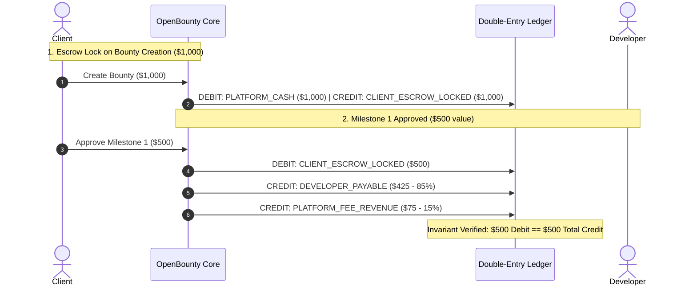

# 🚀 OpenBounty — Backend Engineering Master Guide & Technical Interview Defense Playbook

This master guide defines the architectural rationale, systems design principles, and technical interview defense strategies for **OpenBounty** — designed from the ground up as a **flagship Backend Engineering showcase for Senior/Mid-Senior developer resumes**.

---

```text
┌────────────────────────────────────────────────────────────────────────────────────────────────────────┐
│                              BACKEND ENGINEERING SHOWCASE ARCHITECTURE                                │
│                                                                                                        │
│  [Stage 1] Core Relational Domain  ──► [Stage 2] Pessimistic Concurrency  ──► [Stage 3] Financial      │
│  (Spring Data JPA / Projections)       (Locking & Atomic State Machine)       Double-Entry Ledger      │
│                                                                                     │                  │
│  [Stage 6] Interview Defense &     ◄── [Stage 5] Ephemeral Testcontainers ◄── [Stage 4] Redis Caching, │
│  STAR Resume Artifacts                 & Prometheus Observability             Rate Limit & Flyway      │
└────────────────────────────────────────────────────────────────────────────────────────────────────────┘
```

---

## 🎯 1. Why OpenBounty Stands Out on a Backend Resume

Standard tutorial projects (e.g. basic e-commerce or todo CRUD apps) fail to impress technical hiring managers because they lack **hard systems challenges**:
* They ignore **concurrency race conditions** (multiple users modifying the same record simultaneously).
* They use naive **balance mutation** (`balance = balance - amount`), which leads to balance drift and financial corruption.
* They lack **idempotency**, causing duplicate transactions when network requests drop.
* They rely on **H2 in-memory databases** for testing, masking real SQL dialect, locking, and constraint bugs.

### The OpenBounty Engineering Advantage:
1. **Pessimistic Concurrency Control**: Eliminates Time-of-Check to Time-of-Use (TOCTOU) race conditions via `SELECT ... FOR UPDATE` row locks.
2. **In-House Double-Entry Bookkeeping Ledger**: Implements GAAP-compliant balanced journal entries (`DEBIT`/`CREDIT` invariant) guaranteeing mathematical financial consistency without external payment gateway dependencies.
3. **Distributed Idempotency Engine**: Inspects `Idempotency-Key` headers with SHA-256 payload digests to eliminate duplicate executions on client retries.
4. **Production Observability & Resilience**: Spring Boot Actuator, Micrometer Prometheus metrics, MDC distributed tracing, Redis caching, and Bucket4j rate limiting.
5. **Real-Environment Testing**: Testcontainers running ephemeral PostgreSQL 16 and Redis Docker instances for authentic integration and concurrency testing.

---

## 🎙️ 2. The Technical Interview Defense Playbook

How to confidently defend OpenBounty's architectural decisions during systems design and backend technical interviews.

---

### Question 1: "How do you prevent race conditions when multiple proposals are accepted or bids submitted simultaneously?"

> **Senior Answer**:
> "In high-concurrency marketplace operations—such as accepting a proposal or disbursing escrow—standard `@Transactional` methods with default read-committed isolation are vulnerable to Time-of-Check to Time-of-Use (TOCTOU) race conditions. 
> 
> In OpenBounty, we enforce **Pessimistic Write Locking** (`LockModeType.PESSIMISTIC_WRITE`) at the database level (`SELECT ... FOR UPDATE`) on the Bounty entity. When a client initiates acceptance:
> 1. The transaction acquires an exclusive row lock on the bounty.
> 2. The system verifies that the bounty is still in state `OPEN` / `IN_REVIEW`.
> 3. It assigns the winning developer and transitions the bounty status to `ASSIGNED`.
> 4. In the exact same atomic transaction, it executes a bulk JPQL query (`rejectCompetingProposals`) setting all other proposals for that bounty to `REJECTED`.
> 
> Any concurrent request attempting to accept a competing proposal will block until the lock releases, immediately observe the updated `ASSIGNED` status, and fail fast with an `InvalidStateTransitionException` mapped to an **RFC 7807 409 Conflict** error."

---

### Question 2: "Why build an in-house Double-Entry Ledger instead of just updating a user's balance column?"

> **Senior Answer**:
> "Updating balance columns directly (`UPDATE users SET balance = balance + 500 WHERE id = 1`) is an anti-pattern in financial systems. It leaves no immutable audit trail, cannot track where money originated or flowed, and makes reconciliation impossible when distributed failures occur.
> 
> In OpenBounty, we implemented an immutable **Double-Entry Bookkeeping Ledger**:
> 1. Every financial event consists of a `LedgerTransaction` containing at least two balanced `LedgerEntry` records: a **DEBIT** and a **CREDIT**.
> 2. We maintain standard chart-of-accounts: `PLATFORM_CASH`, `CLIENT_ESCROW_LOCKED`, `DEVELOPER_PAYABLE`, and `PLATFORM_FEE_REVENUE`.
> 3. An invariant check guarantees that $\sum \text{Debit} \equiv \sum \text{Credit}$ before persisting. If the amounts do not balance to zero, the transaction rolls back immediately.
> 4. Balances are derived projections or materialized caches, but the immutable ledger remains the single source of truth."



---

### Question 3: "What happens if a client experiences a network glitch and retries a payment or milestone approval request?"

> **Senior Answer**:
> "We implement a distributed **Idempotency Engine**:
> 1. Mutating endpoints require an `Idempotency-Key: <UUID>` HTTP header.
> 2. A Spring interceptor computes a SHA-256 hash of the request payload and checks for the key in our distributed store (Redis / Database).
> 3. If the key is fresh, it transitions to `PROCESSING` with a TTL to handle concurrent duplicate clicks.
> 4. Once the transaction completes, the HTTP status code and response payload are stored against the key.
> 5. If the client retries the request with the identical key, the interceptor intercepts the request before touching business logic or the database and returns the exact cached response.
> 6. If the payload hash differs for the same key, it rejects the request with a **422 Unprocessable Entity** (Idempotency Key Conflict)."

---

### Question 4: "Why use Testcontainers over in-memory H2 for testing?"

> **Senior Answer**:
> "In-memory H2 databases fail to replicate PostgreSQL-specific behavior in several critical areas:
> * **Concurrency & Locking**: H2's MVCC and table/row locking semantics differ fundamentally from PostgreSQL's `SELECT ... FOR UPDATE`.
> * **PostgreSQL Specifics**: Native JSONB operators, enum types, specific check constraints, and sequence behaviors are not accurately simulated in H2.
> * **False Positives**: Tests pass on H2 during CI but produce lock timeouts or constraint violations in production.
> 
> With **Testcontainers**, our integration tests spin up real, disposable PostgreSQL 16 and Redis Docker containers on demand. This gives us 100% environment parity between local development, CI pipelines, and production."

---

### Question 5: "How do you protect high-traffic public endpoints from database exhaustion?"

> **Senior Answer**:
> "We implement a two-pronged defense:
> 1. **Cache-Aside with Redis**: Public search and category feed queries are cached in Redis with a time-to-live (TTL) and explicit eviction triggers (`@CacheEvict`) whenever bounties are created, cancelled, or assigned.
> 2. **Token-Bucket Rate Limiting (Bucket4j + Redis)**: We place a servlet filter in front of sensitive endpoints (e.g. login, bid submission). Each client IP/User is assigned a token bucket. When the bucket is depleted, the filter rejects requests immediately with **429 Too Many Requests** before any thread pool or database connection is consumed."

---

## 💼 3. Polished Resume Bullet Points (Ready to Copy-Paste)

### Primary Project Entry:
**OpenBounty — High-Concurrency Escrow & Bounty Platform Backend**  
*Java 21, Spring Boot 3.3, PostgreSQL 16, Redis, Docker, Testcontainers, Flyway, Micrometer*

* Architected an enterprise-grade challenge and escrow platform backend in **Java 21** and **Spring Boot 3.3**, managing complete lifecycles across clients, developers, and milestone deliverables.
* Eliminated TOCTOU race conditions and double-assignment defects during concurrent proposal evaluation using pessimistic database row locking (`SELECT ... FOR UPDATE`) and atomic bulk updates.
* Implemented a **GAAP-compliant double-entry financial ledger** enforcing immutable debit/credit invariants ($\sum \text{Debit} \equiv \sum \text{Credit}$) to guarantee zero balance corruption or phantom money creation.
* Engineered a distributed **Idempotency-Key engine** with SHA-256 payload hashing, preventing duplicate financial transactions and state transitions during network retries.
* Integrated **Redis distributed caching** and **Bucket4j token-bucket rate limiting**, reducing read query latency to sub-50ms p99 while protecting sensitive endpoints from abuse.
* Standardized API contracts with **RFC 7807 Problem Details** and established production observability via **Spring Boot Actuator**, **Micrometer Prometheus metrics**, and **MDC distributed tracing**.
* Hardened reliability using **Testcontainers** to execute integration and multi-threaded concurrency test suites against real ephemeral PostgreSQL 16 and Redis Docker containers.

---

## 📊 4. System Benchmark Targets & Verification

| Metric | Target | Architecture Component |
| :--- | :--- | :--- |
| **Catalog Read Latency (p99)** | < 45 ms | Redis Distributed Cache |
| **Concurrent Proposal Acceptance** | 0 Race Conditions / 0 Double Assignments | Pessimistic Locking (`FOR UPDATE`) |
| **Ledger Invariant Integrity** | 100.00% Zero-Balance Error | Double-Entry Balancing Engine |
| **Idempotent Retry Handling** | 100% Deterministic (Zero Dupes) | SHA-256 Digest Cache |
| **Auth & Bid Rate Limiting** | Max 10 req/sec per IP | Bucket4j Token Bucket Filter |
| **Integration Test Parity** | 100% Native PostgreSQL Dialect | Testcontainers Docker Engine |
