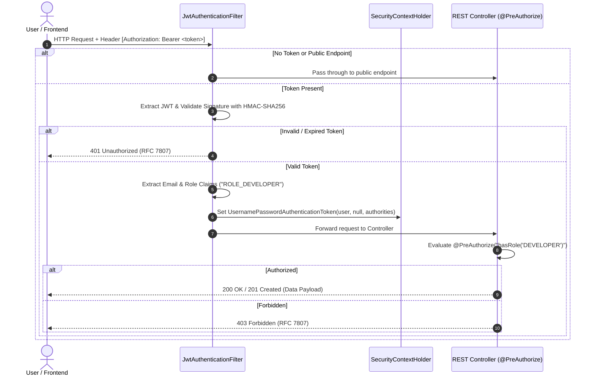

# OpenBounty — Security Architecture & Threat Model

This document specifies the security architecture, authentication lifecycle, Role-Based Access Control (RBAC), and security hardening measures implemented across **OpenBounty**.

---

## 1. Authentication Architecture (Spring Security 6 + Stateless JWT)

OpenBounty utilizes **Stateless JSON Web Token (JWT)** authentication. The server maintains no in-memory HTTP sessions (`SessionCreationPolicy.STATELESS`), allowing horizontal scaling across multiple container replicas behind a load balancer without sticky sessions or distributed session stores.



---

## 2. JWT Token Structure & Claims Specification

* **Algorithm:** HMAC using SHA-256 (`HS256`) with a minimum 256-bit secret key.
* **Token Lifetime:** 24 hours (86,400,000 ms).

### Claims Payload
```json
{
  "sub": "alex.johnson@example.com",
  "userId": 1,
  "role": "ROLE_DEVELOPER",
  "name": "Alex Johnson",
  "iat": 1756669200,
  "exp": 1756755600,
  "iss": "openbounty-api"
}
```

---

## 3. Role-Based Access Control (RBAC) Matrix

| Resource / Action | Endpoint | Public | `ROLE_DEVELOPER` | `ROLE_CLIENT` | `ROLE_ADMIN` |
| :--- | :--- | :---: | :---: | :---: | :---: |
| Register Account | `POST /api/auth/register` | ✅ | ✅ | ✅ | ✅ |
| Authenticate (Login) | `POST /api/auth/login` | ✅ | ✅ | ✅ | ✅ |
| Get Own Profile | `GET /api/auth/me` | ❌ | ✅ | ✅ | ✅ |
| Browse / Filter Bounties | `GET /api/bounties` | ✅ | ✅ | ✅ | ✅ |
| View Single Bounty | `GET /api/bounties/{id}` | ✅ | ✅ | ✅ | ✅ |
| Post a New Bounty | `POST /api/bounties` | ❌ | ❌ | ✅ | ✅ |
| Cancel Bounty | `PATCH /api/bounties/{id}/cancel` | ❌ | ❌ | ✅ *(Owner only)* | ✅ |
| Submit Solution Proposal | `POST /api/bounties/{id}/proposals` | ❌ | ✅ | ❌ | ❌ |
| View Bounty Proposals | `GET /api/bounties/{id}/proposals` | ❌ | ❌ | ✅ *(Owner only)* | ✅ |
| Accept Proposal | `PATCH /api/proposals/{id}/accept` | ❌ | ❌ | ✅ *(Owner only)* | ✅ |
| Reject Proposal | `PATCH /api/proposals/{id}/reject` | ❌ | ❌ | ✅ *(Owner only)* | ✅ |
| Submit Milestone Work | `POST /api/milestones/{id}/submit` | ❌ | ✅ *(Assigned only)* | ❌ | ❌ |
| Approve Milestone | `PATCH /api/milestones/{id}/approve` | ❌ | ❌ | ✅ *(Owner only)* | ✅ |
| Submit Review | `POST /api/reviews` | ❌ | ✅ *(Participant)* | ✅ *(Participant)* | ✅ |
| View Analytics | `GET /api/analytics/**` | ✅ | ✅ | ✅ | ✅ |

---

## 4. Password Hashing & Credential Security

* **Hashing Algorithm:** BCrypt (`org.springframework.security.crypto.bcrypt.BCryptPasswordEncoder`).
* **Work Factor (Strength):** `12` rounds (balancing CPU cost against brute-force resistance).
* **Salt Management:** Unique cryptographically random salt automatically generated per password hash.
* **Sensitive Log Redaction:** Entity `User` explicitly excludes `password` from Lombok `@ToString(exclude = "password")` to prevent credential leakage into log aggregators (ELK / CloudWatch).

---

## 5. Defense-in-Depth & OWASP Top 10 Mitigations

### 1. SQL Injection Prevention
* **Mechanism:** All persistence layer operations use Spring Data JPA parameter-binding and JPQL. No raw string-concatenated SQL queries are permitted.

### 2. Cross-Site Scripting (XSS) & Input Sanitization
* **Mechanism:** Strict Jakarta Bean Validation (`@NotBlank`, `@Size`, `@Pattern`) on all incoming DTOs.
* Output values serialized strictly as JSON objects via Jackson with standard character escaping.

### 3. Cross-Origin Resource Sharing (CORS) Policy
* Development: Allows `http://localhost:3000`, `http://localhost:5173` (React/Vite).
* Production: Restricted to verified domain `https://openbounty.dev` with standard headers (`Authorization`, `Content-Type`).

### 4. Cross-Site Request Forgery (CSRF)
* Because all authenticated requests rely on Bearer tokens sent via HTTP Authorization headers rather than ambient cookies, CSRF protection is safely disabled in the stateless security filter chain.

### 5. Insecure Direct Object References (IDOR) Protection
* State change endpoints (e.g. `acceptProposal`, `approveMilestone`, `cancelBounty`) explicitly verify that the authenticated `userId` in the `SecurityContext` matches the owner of the target entity before executing transactions.
