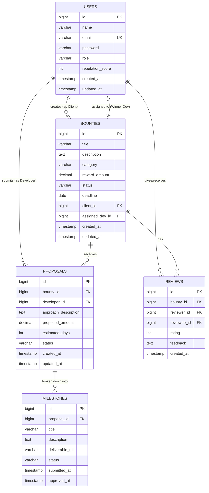

# OpenBounty — Complete System Design Document

---

## 1. Executive Summary & Problem Statement

**OpenBounty** is an open-source decentralized challenge and bounty collaboration platform designed to connect **Clients/Organizations** who have technical and real-world challenges with **Developers/Solvers** who propose and build verified solutions.

This document outlines the end-to-end architecture, database schema, state machines, API contracts, and security rules.

---

## 2. Stakeholders & Roles (RBAC)

1. **`ROLE_CLIENT`**:
   * Creates and funds challenges/bounties.
   * Reviews incoming proposals from developers.
   * Accepts winning proposals and assigns developers.
   * Reviews and approves milestone deliverables.

2. **`ROLE_DEVELOPER`**:
   * Explores open challenges filtered by tags, category, and reward amount.
   * Submits structured proposals with estimated timeline, bid amount, and milestones.
   * Submits deliverable URLs (GitHub, Live demo, Docs) for each milestone.
   * Builds reputation score upon successful completion.

3. **`ROLE_ADMIN`**:
   * Platform governance and content moderation.
   * Access to global analytics and dispute resolution.

---

## 3. Database Schema & Entity-Relationship Diagram (ERD)



---

## 4. Lifecycle State Machines

### A. Bounty Lifecycle
```text
  [ OPEN ]
     │
     ▼ (Developer submits proposal)
  [ IN_REVIEW ]
     │
     ▼ (Client accepts one proposal)
  [ ASSIGNED ]
     │
     ▼ (Developer submits deliverables)
  [ IN_PROGRESS ]
     │
     ▼ (Client approves all milestones)
  [ COMPLETED ]

  * CANCELLED: Can occur from OPEN / IN_REVIEW before a proposal is accepted.
```

### B. Proposal Lifecycle
```text
  [ PENDING ] ──► (Client accepts) ──► [ ACCEPTED ]
       │
       └────────► (Client rejects) ──► [ REJECTED ]
```

### C. Milestone Lifecycle
```text
  [ PENDING ] ──► (Developer submits work) ──► [ SUBMITTED ] ──► (Client approves) ──► [ APPROVED ]
```

---

## 5. Layered Architecture

```text
[ Client (Web/Mobile/Postman) ]
              │ HTTP Requests
              ▼
[ JwtAuthenticationFilter & SecurityFilterChain ]
              │ Authenticated & Authorized Requests
              ▼
[ Controller Layer (@RestController) ] ── (Validates @Valid DTOs, Maps status codes)
              │
              ▼
[ Service Layer (@Service) ] ─────────── (Business rules, state transitions, @Transactional)
              │
              ▼
[ Repository Layer (@Repository) ] ───── (Spring Data JPA interfaces & queries)
              │
              ▼
[ PostgreSQL Database ] ──────────────── (Relational tables with foreign key constraints)
```

---

## 6. Complete REST API Matrix

| HTTP Method | Endpoint | Access Role | Purpose |
| :--- | :--- | :--- | :--- |
| **Auth** | | | |
| `POST` | `/api/auth/register` | Public | Register new user account |
| `POST` | `/api/auth/login` | Public | Authenticate user & return JWT token |
| `GET` | `/api/auth/me` | Authenticated | Get current authenticated user profile |
| **Bounties** | | | |
| `POST` | `/api/bounties` | `CLIENT` | Create a new bounty |
| `GET` | `/api/bounties` | Public | List bounties (with search, category, status filters & pagination) |
| `GET` | `/api/bounties/{id}` | Public | Get single bounty with details |
| `PATCH` | `/api/bounties/{id}/cancel` | `CLIENT` (Owner) | Cancel bounty if no developer accepted |
| **Proposals** | | | |
| `POST` | `/api/bounties/{id}/proposals` | `DEVELOPER` | Submit solution proposal with milestones |
| `GET` | `/api/bounties/{id}/proposals` | `CLIENT` (Owner) | View all proposals submitted for their bounty |
| `PATCH` | `/api/proposals/{id}/accept` | `CLIENT` (Owner) | Accept proposal & transition bounty to ASSIGNED |
| `PATCH` | `/api/proposals/{id}/reject` | `CLIENT` (Owner) | Reject proposal |
| **Milestones** | | | |
| `POST` | `/api/milestones/{id}/submit` | `DEVELOPER` (Assigned) | Submit deliverable URL/proof for milestone |
| `PATCH` | `/api/milestones/{id}/approve` | `CLIENT` (Owner) | Approve completed milestone |
| **Analytics** | | | |
| `GET` | `/api/analytics/overview` | Public / Admin | Total bounties, funds paid, active developers |
| `GET` | `/api/analytics/categories` | Public | Distribution of bounties across categories |

---

## 7. Role-Based Access Control (RBAC) Matrix

| Resource / Action | Public | `ROLE_DEVELOPER` | `ROLE_CLIENT` | `ROLE_ADMIN` |
| :--- | :---: | :---: | :---: | :---: |
| Browse & Search Bounties | ✅ | ✅ | ✅ | ✅ |
| Post a New Bounty | ❌ | ❌ | ✅ | ✅ |
| Submit Solution Proposal | ❌ | ✅ | ❌ | ❌ |
| Accept / Reject Proposal | ❌ | ❌ | ✅ (Owner only) | ✅ |
| Submit Milestone Work | ❌ | ✅ (Assigned only) | ❌ | ❌ |
| Approve Milestone | ❌ | ❌ | ✅ (Owner only) | ✅ |
| Platform Analytics | ✅ | ✅ | ✅ | ✅ |
