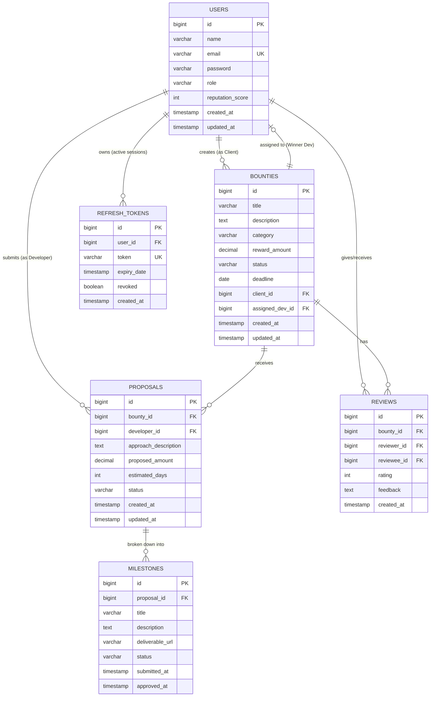
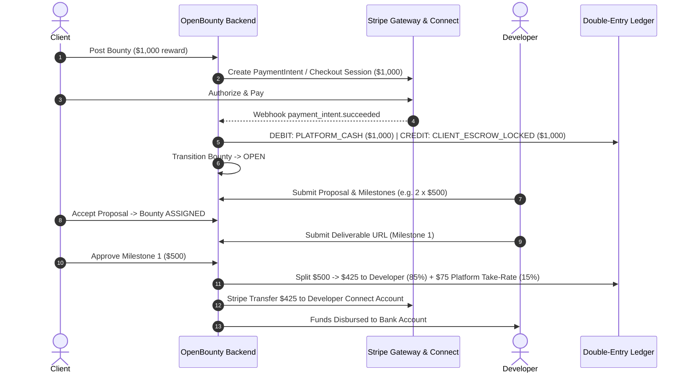

# OpenBounty — Complete System Design Document

---

## 1. Executive Summary & Dual-Track Philosophy

**OpenBounty** is an enterprise-grade, escrow-backed challenge and bounty collaboration marketplace designed to connect **Clients/Organizations** who have technical problems with **Developers/Solvers** who propose and build milestone-verified solutions.

The platform is architected around a **Dual-Track Strategy**:
1. **Track 1: Resume & Senior Engineering Signal**: Engineered to demonstrate mastery of hard backend problems—concurrency race condition prevention (`SELECT ... FOR UPDATE`), immutable double-entry financial bookkeeping, idempotent request execution, and containerized integration testing via Testcontainers.
2. **Track 2: Commercial Marketplace Viability**: Engineered as a self-sustaining business—Stripe Connect custodial escrow, automated 10–15% platform take-rate, dispute protocol, and 14-day inactivity auto-release guards.

This document outlines the end-to-end architecture, relational schema, financial escrow rails, state machines, API contracts, and security rules.

---

## 2. Stakeholders & Roles (RBAC)

1. **`ROLE_CLIENT`**:
   * Creates and funds challenges/bounties via Stripe escrow.
   * Reviews incoming proposals from developers.
   * Accepts winning proposals and assigns developers.
   * Reviews and approves milestone deliverables or requests revisions.
   * Leaves reviews and ratings upon bounty completion.

2. **`ROLE_DEVELOPER`**:
   * Explores open challenges filtered by tags, category, and reward amount.
   * Submits structured proposals with estimated timeline, bid amount, and milestone breakdown.
   * Connects bank account via Stripe Connect for automated payouts.
   * Submits deliverable URLs (GitHub PR, Live demo, Docs) for each milestone.
   * Builds public on-chain/platform reputation score upon successful completion.

3. **`ROLE_ADMIN`**:
   * Platform governance, user verification, and content moderation.
   * Arbitration panel for disputed milestones and escrow settlements.
   * Access to global financial metrics, platform gross merchandise volume (GMV), and commission analytics.

---

## 3. Database Schema & Entity-Relationship Diagram (ERD)



---

## 4. Lifecycle State Machines

### A. Bounty Lifecycle
```text
  [ DRAFT ] ──► (Client funds escrow via Stripe) ──► [ OPEN ]
                                                         │
                                                         ▼ (Developer submits proposal)
                                                    [ IN_REVIEW ]
                                                         │
                                                         ▼ (Client accepts one proposal)
                                                    [ ASSIGNED ]
                                                         │
                                                         ▼ (Developer submits deliverables)
                                                    [ IN_PROGRESS ]
                                                         │
                                                         ▼ (Client approves 100% of milestones)
                                                    [ COMPLETED ] (Triggers payout release)

  * CANCELLED: Permitted only from OPEN / IN_REVIEW prior to developer assignment.
  * DISPUTED: Triggers when either party raises a dispute on a milestone.
```

### B. Proposal Lifecycle
```text
  [ PENDING ] ──► (Client accepts) ──► [ ACCEPTED ] (Auto-rejects competing bids)
       │
       └────────► (Client rejects / Bounty cancelled) ──► [ REJECTED ]
```

### C. Milestone Lifecycle
```text
  [ PENDING ] ──► (Developer submits work) ──► [ SUBMITTED ]
                                                    │
                   ┌────────────────────────────────┴──────────────────────────────┐
                   ▼                                                               ▼
        (Client approves)                                                (Client requests revision)
                   │                                                               │
                   ▼                                                               ▼
             [ APPROVED ] ──► (Disburses milestone funds)                  [ REVISION_REQUESTED ]
                                                                                   │
                                                                                   ▼
                                                                           (Resubmit deliverable)
```

---

## 5. Commercial Escrow & Monetization Architecture



---

## 6. Layered Enterprise Architecture

```text
[ Client Application (Next.js / React / Mobile) ]
                      │ HTTPS (REST + WebSockets)
                      ▼
[ Cloudflare WAF + SSL Termination + DDoS Defense ]
                      │
                      ▼
[ Spring Security 6 Filter Chain (Stateless JWT + RTR + CORS) ]
                      │
                      ▼
[ Controller Layer (@RestController) ] ── Validates Jakarta DTOs, Handles RFC 7807 responses
                      │
                      ▼
[ Service Layer (@Service) ] ──────────── State machine transitions, Concurrency locks (@Transactional)
         │                   │                         │
         ▼                   ▼                         ▼
[ Stripe / Escrow Engine ] [ S3 / R2 Object Storage ] [ Spring Events / Async Workers ]
         │                   │                         │
         ▼                   ▼                         ▼
[ Payment Webhooks ]   [ Deliverable Proofs ]     [ Email Notifications / Auto-release ]
                      │
                      ▼
[ Repository Layer (@Repository) ] ────── Spring Data JPA, Pessimistic Locking, Projections
                      │
                      ▼
[ PostgreSQL Managed DB ] ────────────── Relational tables, Flyway migrations, B-Tree indexes
```

---

## 7. REST API Endpoint Matrix

| HTTP Method | Endpoint | Access Role | Purpose |
| :--- | :--- | :--- | :--- |
| **Authentication** | | | |
| `POST` | `/api/auth/register` | Public | Register client or developer account |
| `POST` | `/api/auth/login` | Public | Authenticate user & return JWT + Refresh token |
| `POST` | `/api/auth/refresh` | Public | Rotate refresh token with reuse detection |
| `POST` | `/api/auth/logout` | Authenticated | Invalidate active refresh token session |
| `GET` | `/api/auth/me` | Authenticated | Retrieve authenticated user profile |
| **Bounties** | | | |
| `POST` | `/api/bounties` | `ROLE_CLIENT` | Create technical challenge (XSS sanitized) |
| `GET` | `/api/bounties` | Public | Search, filter, and paginate open challenges |
| `GET` | `/api/bounties/{id}` | Public | Get single bounty with full details |
| `PATCH` | `/api/bounties/{id}/cancel` | `ROLE_CLIENT` (Owner) | Cancel bounty and auto-reject pending proposals |
| **Proposals** | | | |
| `POST` | `/api/bounties/{id}/proposals` | `ROLE_DEVELOPER` | Submit technical solution proposal |
| `GET` | `/api/bounties/{id}/proposals` | `ROLE_CLIENT` (Owner) | View all proposals for owner's bounty |
| `PATCH` | `/api/proposals/{id}/accept` | `ROLE_CLIENT` (Owner) | Concurrently lock bounty and assign developer |
| `PATCH` | `/api/proposals/{id}/reject` | `ROLE_CLIENT` (Owner) | Explicitly reject a proposal |
| **Milestones** | | | |
| `POST` | `/api/milestones/{id}/submit` | `ROLE_DEVELOPER` (Assigned)| Submit deliverable proof (PR, staging URL, docs) |
| `PATCH` | `/api/milestones/{id}/approve` | `ROLE_CLIENT` (Owner) | Approve milestone & trigger payout disbursement |
| `POST` | `/api/milestones/{id}/revision` | `ROLE_CLIENT` (Owner) | Request revisions on submitted deliverable |
| `POST` | `/api/milestones/{id}/dispute` | Assigned Dev / Owner | Freeze milestone escrow and escalate to admin |
| **Reviews & Reputation** | | | |
| `POST` | `/api/reviews` | Assigned Dev / Owner | Submit 1–5 star rating and feedback post-completion |
| `GET` | `/api/users/{id}/reviews` | Public | View received reviews and reputation history |
| **Platform Analytics** | | | |
| `GET` | `/api/analytics/overview` | Public | Total bounties, funds disbursed, active solver count |
| `GET` | `/api/analytics/categories` | Public | Category distribution and volume breakdown |
