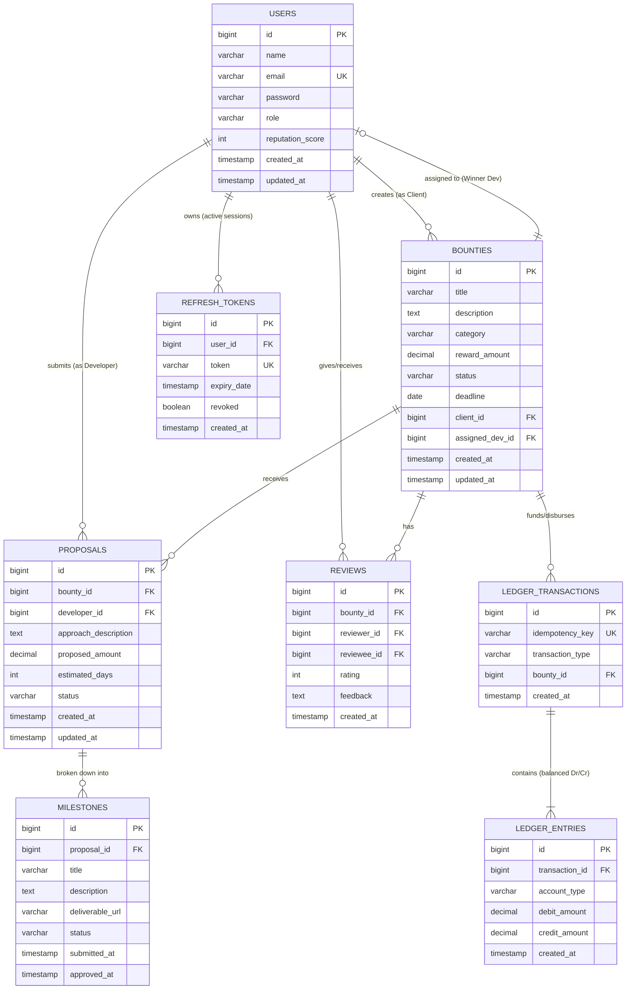
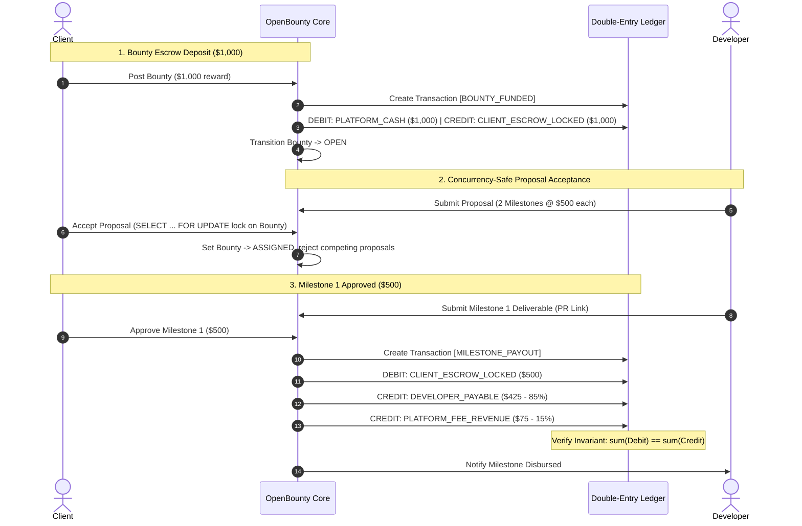

# OpenBounty — Complete System Design Document

---

## 1. Executive Summary & Backend Systems Philosophy

**OpenBounty** is an enterprise-grade, escrow-backed challenge and bounty backend system designed to connect **Clients/Organizations** who have technical problems with **Developers/Solvers** who propose and build milestone-verified solutions.

Architected specifically as a **high-signal backend engineering showcase for technical resumes and interview defense**, OpenBounty emphasizes solving complex distributed and transactional backend challenges:
1. **Pessimistic Concurrency Control**: Eliminating Time-of-Check to Time-of-Use (TOCTOU) race conditions during simultaneous proposal evaluations and milestone approvals via `SELECT ... FOR UPDATE` row locks.
2. **In-House Double-Entry Financial Ledger**: Enforcing immutable debit/credit invariants ($\sum \text{Debit} \equiv \sum \text{Credit}$) across GAAP accounts without external payment gateway dependencies.
3. **Distributed Idempotency Guarantees**: Protecting mutating state transitions and disbursements against duplicate execution caused by network retries via `Idempotency-Key` headers and SHA-256 digests.
4. **Distributed Caching & Rate Limiting**: Leveraging Redis for high-throughput query caching and Bucket4j token-bucket filters to protect endpoints from abuse.
5. **Real Container Testing via Testcontainers**: Validating database locking, transactional isolation, and native constraints against real ephemeral PostgreSQL 16 and Redis containers.

---

## 2. Stakeholders & Roles (RBAC)

1. **`ROLE_CLIENT`**:
   * Creates challenges/bounties and deposits escrow funds into the platform ledger.
   * Reviews incoming proposals from developers.
   * Accepts winning proposals, triggering pessimistic locks and atomic rejection of competing bids.
   * Reviews and approves milestone deliverables or requests revisions.
   * Leaves reviews and ratings upon bounty completion.

2. **`ROLE_DEVELOPER`**:
   * Explores open challenges filtered by tags, category, and reward amount.
   * Submits structured proposals with estimated timeline, bid amount, and milestone breakdown.
   * Submits deliverable URLs (GitHub PR, Live demo, Docs) for each milestone.
   * Receives verified escrow disbursements credited to their ledger account.
   * Builds an algorithmic reputation score upon successful on-time delivery.

3. **`ROLE_ADMIN`**:
   * Platform governance, user verification, and content moderation.
   * Arbitration panel for disputed milestones and escrow settlements.
   * Access to global financial metrics, platform volume, and ledger audit reports.

---

## 3. Database Schema & Entity-Relationship Diagram (ERD)



---

## 4. Lifecycle State Machines

### A. Bounty Lifecycle
```text
  [ DRAFT ] ──► (Client deposits escrow funds) ──► [ OPEN ]
                                                      │
                                                      ▼ (Developer submits proposal)
                                                 [ IN_REVIEW ]
                                                      │
                                                      ▼ (Client accepts one proposal via Pessimistic Lock)
                                                 [ ASSIGNED ]
                                                      │
                                                      ▼ (Developer submits deliverables)
                                                 [ IN_PROGRESS ]
                                                      │
                                                      ▼ (Client approves 100% of milestones)
                                                 [ COMPLETED ] (Triggers final payout release)

  * CANCELLED: Permitted only from OPEN / IN_REVIEW prior to developer assignment (refunds client escrow).
  * DISPUTED: Triggers when either party raises a dispute on a milestone.
```

### B. Proposal Lifecycle
```text
  [ PENDING ] ──► (Client accepts with FOR UPDATE lock) ──► [ ACCEPTED ] (Auto-rejects competing bids)
       │
       └────────► (Client rejects / Bounty cancelled)  ──► [ REJECTED ]
```

### C. Milestone Lifecycle
```text
  [ PENDING ] ──► (Developer submits work) ──► [ SUBMITTED ]
                                                     │
                    ┌────────────────────────────────┴──────────────────────────────┐
                    ▼                                                               ▼
         (Client approves)                                                (Client requests revision)
                    │                                                               │
                    ▼                                                               ▼
              [ APPROVED ] ──► (Disburses milestone ledger funds)           [ REVISION_REQUESTED ]
                                                                                    │
                                                                                    ▼
                                                                            (Resubmit deliverable)
```

---

## 5. In-House Double-Entry Ledger & Escrow Accounting Architecture



---

## 6. Layered Enterprise Architecture

```text
[ Client (Frontend Web / Mobile / API Consumer) ]
                      │ HTTPS (RESTful API)
                      ▼
[ Cloudflare / Reverse Proxy ]
                      │
                      ▼
[ RateLimitingFilter (Bucket4j + Redis) ] ── Token-Bucket rate limiting on public endpoints
                      │
                      ▼
[ Spring Security 6 Filter Chain (Stateless JWT + RTR + CORS) ]
                      │
                      ▼
[ IdempotencyKeyInterceptor ] ────────────── Caches & verifies Idempotency-Key SHA-256 hashes
                      │
                      ▼
[ Controller Layer (@RestController) ] ───── Validates Jakarta DTOs, Maps RFC 7807 responses
                      │
                      ▼
[ Service Layer (@Service) ] ─────────────── State machine transitions, Concurrency locks (@Transactional)
         │                   │                         │
         ▼                   ▼                         ▼
[ Double-Entry Ledger ] [ Redis Cache Layer ]     [ Inactivity Auto-Release Guard ]
(Immutable Debit/Credit)  (@Cacheable / @CacheEvict)(@Scheduled Background Worker)
                      │
                      ▼
[ Repository Layer (@Repository) ] ───────── Spring Data JPA, Pessimistic Locking, Projections
                      │
                      ▼
[ PostgreSQL 16 Database ] ───────────────── Flyway Migrations, Foreign Keys, B-Tree Indexes
```

---

## 7. REST API Endpoint Matrix

| HTTP Method | Endpoint | Access Role | Purpose |
| :--- | :--- | :--- | :--- |
| **Authentication** | | | |
| `POST` | `/api/auth/register` | Public | Register client or developer account |
| `POST` | `/api/auth/login` | Public | Authenticate user & return JWT + Refresh token |
| `POST` | `/api/auth/refresh` | Public | Rotate refresh token with reuse detection |
| `POST` | `/api/auth/logout` | Authenticated | Invalidate active refresh token session |
| `GET` | `/api/auth/me` | Authenticated | Retrieve authenticated user profile |
| **Bounties** | | | |
| `POST` | `/api/bounties` | `ROLE_CLIENT` | Create technical challenge (XSS sanitized, funds escrow) |
| `GET` | `/api/bounties` | Public | Search, filter, and paginate open challenges (Redis cached) |
| `GET` | `/api/bounties/{id}` | Public | Get single bounty with full details |
| `PATCH` | `/api/bounties/{id}/cancel` | `ROLE_CLIENT` (Owner) | Cancel bounty and refund escrow locked funds |
| **Proposals** | | | |
| `POST` | `/api/bounties/{id}/proposals` | `ROLE_DEVELOPER` | Submit technical solution proposal |
| `GET` | `/api/bounties/{id}/proposals` | `ROLE_CLIENT` (Owner) | View all proposals for owner's bounty |
| `PATCH` | `/api/proposals/{id}/accept` | `ROLE_CLIENT` (Owner) | Concurrently lock bounty and assign developer |
| `PATCH` | `/api/proposals/{id}/reject` | `ROLE_CLIENT` (Owner) | Explicitly reject a proposal |
| **Milestones** | | | |
| `POST` | `/api/milestones/{id}/submit` | `ROLE_DEVELOPER` (Assigned)| Submit deliverable proof (PR, staging URL, docs) |
| `PATCH` | `/api/milestones/{id}/approve` | `ROLE_CLIENT` (Owner) | Approve milestone & trigger ledger disbursement |
| `POST` | `/api/milestones/{id}/request-revision` | `ROLE_CLIENT` (Owner) | Request revisions on submitted deliverable |
| `POST` | `/api/milestones/{id}/dispute` | Assigned Dev / Owner | Freeze milestone escrow and escalate to admin |
| **Reviews & Reputation** | | | |
| `POST` | `/api/reviews` | Assigned Dev / Owner | Submit 1–5 star rating and feedback post-completion |
| `GET` | `/api/users/{id}/reviews` | Public | View received reviews and reputation history |
| **Financial Ledger (In-House Escrow)** | | | |
| `GET` | `/api/ledger/accounts/{userId}` | Authenticated / Admin | View double-entry ledger balance summary |
| `GET` | `/api/ledger/transactions/{bountyId}` | Authenticated / Admin | View immutable audit trail of balanced entries |
| **Platform Telemetry & Health** | | | |
| `GET` | `/actuator/health` | Public | Health, readiness, and liveness probes |
| `GET` | `/actuator/prometheus` | Prometheus Scraper | Micrometer system & custom application metrics |
